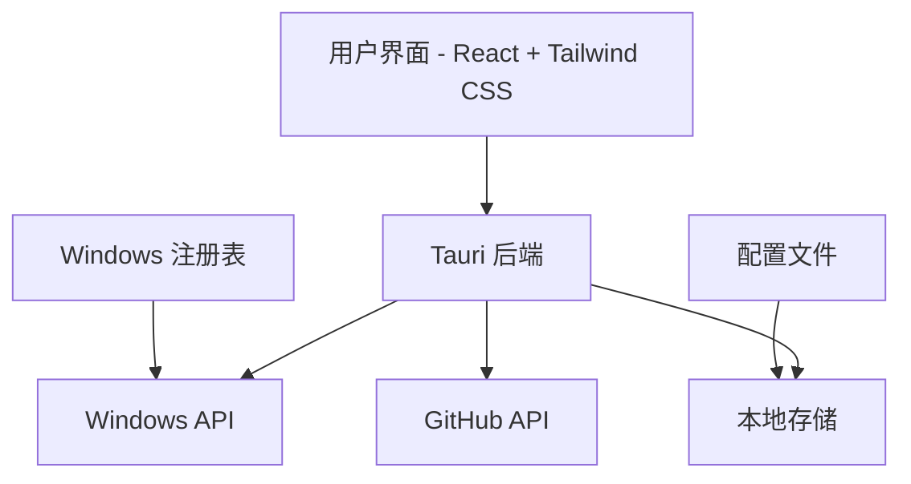
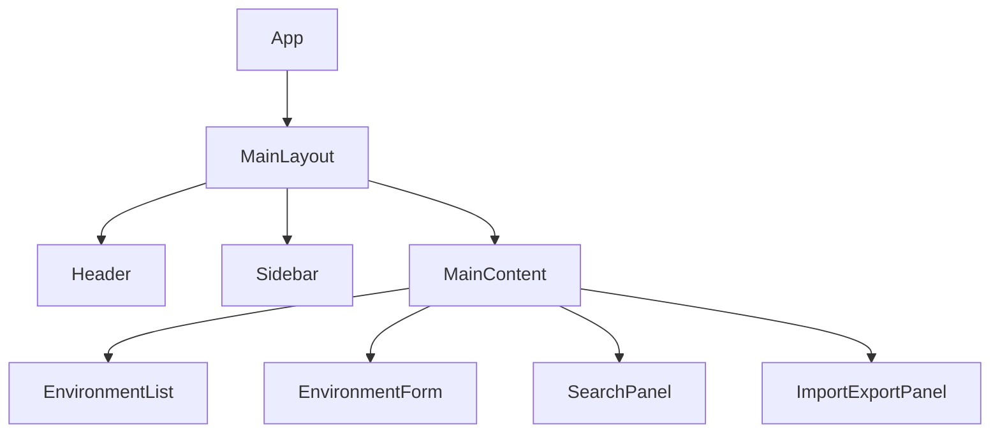
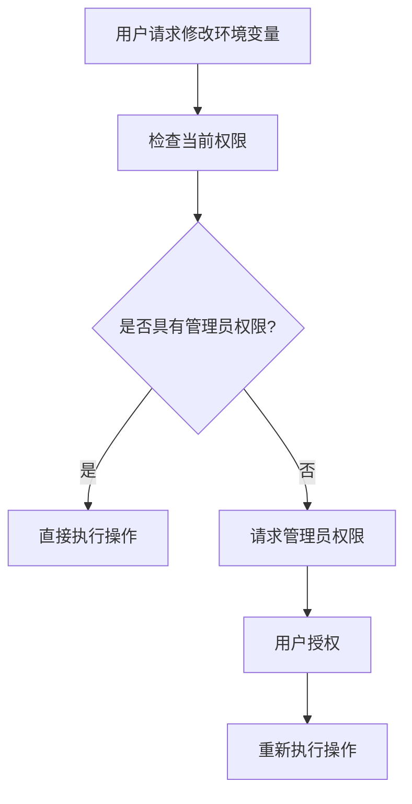

# 环境变量管理器 (env-manager) 设计文档

## 0. 项目信息

- **项目名称**: env-manager
- **项目类型**: Windows 桌面应用程序
- **技术栈**: React + Vite + Tauri + TypeScript + Tailwind CSS
- **开源平台**: GitHub
- **目标用户**: Windows 系统用户，特别是开发者和系统管理员

## 1. 概述

环境变量管理器(env-manager)是一个基于 Tauri 构建的 Windows 桌面应用程序，旨在提供直观且功能强大的界面来管理 Windows 系统环境变量。该应用允许用户查看、添加、编辑和删除环境变量，同时支持备注功能、有效性检测、导入导出以及批量操作。

## 2. 技术栈

- 前端框架: React + TypeScript
- 构建工具: Vite
- 桌面应用框架: Tauri
- 样式框架: Tailwind CSS
- 状态管理: React Hooks
- 数据持久化: Tauri 内置存储
- 打包部署: GitHub Actions

## 3. 项目结构

```
env-manager/
├── src/
│   ├── components/          # React 组件
│   ├── hooks/               # 自定义 React Hooks
│   ├── utils/               # 工具函数
│   ├── App.tsx              # 主应用组件
│   └── main.tsx             # 应用入口
├── src-tauri/
│   ├── src/
│   │   ├── main.rs          # Tauri 后端主文件
│   │   ├── commands.rs      # Tauri 命令实现
│   │   └── tray.rs          # 系统托盘实现
│   ├── Cargo.toml           # Rust 依赖配置
│   └── tauri.conf.json      # Tauri 配置文件
├── public/                  # 静态资源
├── index.html               # HTML 模板
├── package.json             # Node.js 依赖配置
├── tailwind.config.js       # Tailwind CSS 配置
└── vite.config.ts           # Vite 配置
```

## 3. 功能需求

### 3.1 核心功能

1. **环境变量管理**
   - 查看系统环境变量列表
   - 添加新的环境变量
   - 编辑现有环境变量
   - 删除环境变量
   - 为每个环境变量添加备注说明

2. **环境变量同步**
   - 所有操作实时同步到 Windows 系统环境变量
   - 需要管理员权限的操作提示用户提升权限

3. **环境变量检测**
   - 一键检测环境变量有效性
   - 对无效的环境变量进行特殊标记

4. **导入导出功能**
   - 导出当前环境变量配置到文件
   - 从文件导入环境变量配置
   - 支持批量设置环境变量到系统中

5. **查询功能**
   - 根据环境变量名称关键字查询
   - 根据备注关键字查询
   - 可设置时间范围查询

6. **快捷键功能**
   - 支持自定义快捷键启动应用
   - 应用启动时默认最小化到系统托盘

7. **更新提醒**
   - 检查 GitHub 上的新版本
   - 提醒用户有可用更新

### 3.2 非功能需求

1. **权限管理**
   - 修改系统环境变量需要管理员权限
   - 应用启动时检查并请求必要权限

2. **用户界面**
   - 简洁直观的用户界面
   - 响应式设计适配不同屏幕尺寸
   - 支持深色/浅色主题

3. **性能要求**
   - 快速加载环境变量列表
   - 实时响应用户操作
   - 低内存占用

## 4. 架构设计

### 4.1 系统架构



### 4.2 组件架构



### 4.3 数据流


## 5. 核心模块设计

### 5.1 环境变量管理模块

#### 5.1.3 Tauri 后端 API

```rust
// 获取所有环境变量
#[tauri::command]
async fn get_environment_variables() -> Result<Vec<EnvironmentVariable>, String> {}

// 添加环境变量
#[tauri::command]
async fn add_environment_variable(variable: EnvironmentVariable) -> Result<EnvironmentVariable, String> {}

// 更新环境变量
#[tauri::command]
async fn update_environment_variable(id: String, variable: EnvironmentVariable) -> Result<EnvironmentVariable, String> {}

// 删除环境变量
#[tauri::command]
async fn delete_environment_variable(id: String) -> Result<(), String> {}

// 验证环境变量
#[tauri::command]
async fn validate_environment_variable(id: String) -> Result<bool, String> {}
```

#### 5.1.1 数据结构

```typescript
interface EnvironmentVariable {
  id: string;
  name: string;
  value: string;
  type: 'user' | 'system';
  remark: string;
  createdAt: Date;
  updatedAt: Date;
  isValid: boolean;
}
```

#### 5.1.2 功能接口

- `getEnvironmentVariables(): Promise<EnvironmentVariable[]>`
- `addEnvironmentVariable(variable: Omit<EnvironmentVariable, 'id'>): Promise<EnvironmentVariable>`
- `updateEnvironmentVariable(id: string, variable: Partial<EnvironmentVariable>): Promise<EnvironmentVariable>`
- `deleteEnvironmentVariable(id: string): Promise<void>`
- `validateEnvironmentVariable(id: string): Promise<boolean>`

### 5.2 导入导出模块

#### 5.2.1 数据格式

```json
{
  "version": "1.0",
  "exportedAt": "2023-01-01T00:00:00Z",
  "variables": [
    {
      "name": "PATH",
      "value": "C:\\Windows\\System32",
      "type": "system",
      "remark": "系统路径"
    }
  ]
}
```

#### 5.2.2 导入时的冲突处理

导入环境变量时可能遇到以下情况:

1. 变量名已存在且值相同: 跳过
2. 变量名已存在但值不同: 提示用户选择覆盖或跳过
3. 新增变量: 直接添加

#### 5.2.2 功能接口

- `exportEnvironmentVariables(): Promise<string>` // 返回文件路径
- `importEnvironmentVariables(filePath: string): Promise<EnvironmentVariable[]>`

#### 5.2.3 Tauri 后端 API

```rust
// 导出环境变量到文件
#[tauri::command]
async fn export_environment_variables() -> Result<String, String> {}

// 从文件导入环境变量
#[tauri::command]
async fn import_environment_variables(file_path: String) -> Result<Vec<EnvironmentVariable>, String> {}
```

### 5.3 查询模块

#### 5.3.1 功能接口

- `searchEnvironmentVariables(query: SearchQuery): Promise<EnvironmentVariable[]>`

#### 5.3.2 Tauri 后端 API

```rust
// 搜索环境变量
#[tauri::command]
async fn search_environment_variables(query: SearchQuery) -> Result<Vec<EnvironmentVariable>, String> {}
```

```typescript
interface SearchQuery {
  nameKeyword?: string;
  remarkKeyword?: string;
  dateRange?: {
    start: Date;
    end: Date;
  };
}
```

### 5.4 快捷键模块

#### 5.4.1 功能接口

- `registerShortcut(shortcut: string): Promise<void>`
- `unregisterShortcut(): Promise<void>`
- `getRegisteredShortcut(): Promise<string>`

#### 5.4.2 Tauri 后端 API

```rust
// 注册快捷键
#[tauri::command]
async fn register_shortcut(shortcut: String) -> Result<(), String> {}

// 注销快捷键
#[tauri::command]
async fn unregister_shortcut() -> Result<(), String> {}

// 获取已注册的快捷键
#[tauri::command]
async fn get_registered_shortcut() -> Result<String, String> {}
```

### 5.5 更新检查模块

#### 5.5.1 功能接口

- `checkForUpdates(): Promise<UpdateInfo | null>`

#### 5.5.2 Tauri 后端 API

```rust
// 检查更新
#[tauri::command]
async fn check_for_updates() -> Result<Option<UpdateInfo>, String> {}
```

```typescript
interface UpdateInfo {
  version: string;
  releaseNotes: string;
  downloadUrl: string;
}
```

## 6. 权限设计

### 6.1 权限需求

1. **读取环境变量**: 无需特殊权限
2. **修改环境变量**: 需要管理员权限
3. **注册快捷键**: 无需特殊权限
4. **访问 GitHub API**: 无需特殊权限

### 6.2 权限处理流程



#### 6.3 Tauri 权限管理 API

```rust
// 检查是否具有管理员权限
#[tauri::command]
async fn check_admin_privileges() -> Result<bool, String> {}

// 请求管理员权限
#[tauri::command]
async fn request_admin_privileges() -> Result<(), String> {}
```

## 7. 用户界面设计

### 7.0 系统托盘功能

应用启动时默认最小化到系统托盘，支持以下功能:

1. 左键单击托盘图标显示/隐藏主窗口
2. 右键单击托盘图标显示上下文菜单
3. 支持自定义托盘菜单项

#### 7.0.1 Tauri 系统托盘实现

```rust
// 创建系统托盘
fn create_tray() -> SystemTray {
    let tray_menu = SystemTrayMenu::new()
        .add_item(CustomMenuItem::new("toggle".to_string(), "显示/隐藏"))
        .add_item(CustomMenuItem::new("quit".to_string(), "退出"));
        
    SystemTray::new()
        .with_menu(tray_menu)
        .with_tooltip("环境变量管理器")
}

// 处理托盘事件
fn handle_tray_event(app: &AppHandle, event: SystemTrayEvent) {
    match event {
        SystemTrayEvent::LeftClick { .. } => {
            // 显示/隐藏主窗口
        }
        SystemTrayEvent::MenuItemClick { id, .. } => {
            match id.as_str() {
                "toggle" => {
                    // 切换窗口显示状态
                }
                "quit" => {
                    // 退出应用
                }
                _ => {}
            }
        }
        _ => {}
    }
}
```

### 7.1 主界面布局

```
+--------------------------------------------------+
| 菜单栏 | 搜索框 | 导入/导出 | 设置 | 最小化 | 关闭 |
+--------------------------------------------------+
| 侧边栏 |                                          |
| - 全部变量                                       |
| - 用户变量                                       |
| - 系统变量                                       |
| - 无效变量                                       |
|                                                  |
+--------+-----------------------------------------+
|        | 环境变量列表                            |
|        |                                         |
|        | [+] 添加变量   [⟳] 刷新   [✓] 检测      |
|        |                                         |
|        | NAME     | VALUE      | 备注 | 操作     |
|        | PATH     | C:\Windows | 系统 | 编辑/删除 |
|        | JAVA_HOME| C:\Java    | Java | 编辑/删除 |
+--------+-----------------------------------------+
```

### 7.2 添加/编辑变量对话框

```
+---------------------------------+
| 添加/编辑环境变量               |
+---------------------------------+
| 名称: [_______________________] |
| 值:   [_______________________] |
| 类型: (○ 用户变量) (● 系统变量)  |
| 备注: [_______________________] |
|                                 |
| [保存] [取消]                   |
+---------------------------------+
```

### 7.3 导入导出面板

```
+---------------------------------+
| 导入/导出环境变量               |
+---------------------------------+
| 导出:                           |
| [导出当前配置] [选择保存位置]    |
|                                 |
| 导入:                           |
| [选择配置文件] [导入并应用]      |
+---------------------------------+
```

## 8. 存储设计

### 8.1 本地存储

使用 Tauri 提供的本地存储功能保存用户设置:

- 快捷键配置
- 用户界面偏好设置
- 最近导出的文件路径

#### 8.1.1 配置文件结构

```json
{
  "shortcut": "Ctrl+Shift+E",
  "theme": "dark",
  "lastExportPath": "C:\\Users\\User\\Documents\\env-export.json",
  "autoCheckUpdates": true,
  "startMinimized": true
}
```

### 8.2 Windows 注册表操作

#### 8.2.1 注册表路径

- 用户变量: `HKEY_CURRENT_USER\Environment`
- 系统变量: `HKEY_LOCAL_MACHINE\SYSTEM\CurrentControlSet\Control\Session Manager\Environment`

#### 8.2.2 Rust 注册表操作示例

```rust
use winreg::RegKey;
use winreg::enums::*;

// 读取环境变量
fn read_environment_variable(name: &str, is_system: bool) -> Result<String, Box<dyn std::error::Error>> {
    let hklm = RegKey::predef(HKEY_LOCAL_MACHINE);
    let hkcu = RegKey::predef(HKEY_CURRENT_USER);
    
    let env_key = if is_system {
        hklm.open_subkey("SYSTEM\CurrentControlSet\Control\Session Manager\Environment")?
    } else {
        hkcu.open_subkey("Environment")?
    };
    
    let value: String = env_key.get_value(name)?;
    Ok(value)
}

// 设置环境变量
fn set_environment_variable(name: &str, value: &str, is_system: bool) -> Result<(), Box<dyn std::error::Error>> {
    let hklm = RegKey::predef(HKEY_LOCAL_MACHINE);
    let hkcu = RegKey::predef(HKEY_CURRENT_USER);
    
    let env_key = if is_system {
        hklm.open_subkey_with_flags(
            "SYSTEM\CurrentControlSet\Control\Session Manager\Environment", 
            KEY_SET_VALUE
        )?
    } else {
        hkcu.open_subkey_with_flags("Environment", KEY_SET_VALUE)?
    };
    
    env_key.set_value(name, &value)?;
    Ok(())
}

// 删除环境变量
fn delete_environment_variable(name: &str, is_system: bool) -> Result<(), Box<dyn std::error::Error>> {
    let hklm = RegKey::predef(HKEY_LOCAL_MACHINE);
    let hkcu = RegKey::predef(HKEY_CURRENT_USER);
    
    let env_key = if is_system {
        hklm.open_subkey_with_flags(
            "SYSTEM\CurrentControlSet\Control\Session Manager\Environment", 
            KEY_SET_VALUE
        )?
    } else {
        hkcu.open_subkey_with_flags("Environment", KEY_SET_VALUE)?
    };
    
    env_key.delete_value(name)?;
    Ok(())
}
```

使用 Tauri 提供的本地存储功能保存用户设置:

- 快捷键配置
- 用户界面偏好设置
- 最近导出的文件路径

### 8.2 系统存储

环境变量实际存储在 Windows 注册表中:

- 用户变量: `HKEY_CURRENT_USER\Environment`
- 系统变量: `HKEY_LOCAL_MACHINE\SYSTEM\CurrentControlSet\Control\Session Manager\Environment`

## 9. 安全设计

### 9.1 权限安全

1. 仅在必要时请求管理员权限
2. 明确告知用户为何需要管理员权限
3. 对敏感操作进行二次确认

### 9.2 数据安全

1. 导出文件不包含敏感信息
2. 本地存储的数据进行适当加密
3. 网络请求使用 HTTPS 协议

## 10. 错误处理与日志记录

### 10.1 错误处理策略

1. 前端错误: 显示友好的错误提示信息
2. 后端错误: 记录详细错误日志并返回简洁错误信息
3. 系统错误: 提供详细的错误诊断信息

### 10.2 日志记录

使用 Tauri 提供的日志功能记录应用运行状态:

- 操作日志: 记录用户的关键操作
- 错误日志: 记录应用运行时的错误信息
- 调试日志: 开发阶段用于调试的信息

## 11. 部署与发布

### 11.1 构建流程

使用 GitHub Actions 实现自动化构建和发布:

1. 代码推送到 GitHub
2. 触发构建流程
3. 执行测试
4. 打包应用程序
5. 创建 GitHub Release
6. 上传安装包

### 11.2 版本管理

遵循语义化版本控制(SemVer):

- 主版本号(MAJOR): 不兼容的API修改
- 次版本号(MINOR): 向后兼容的功能性新增
- 修订号(PATCH): 向后兼容的问题修正

版本格式: `v{MAJOR}.{MINOR}.{PATCH}` (例如: v1.2.3)

#### 10.1.1 GitHub Actions 工作流示例

```yaml
name: Build and Release

on:
  push:
    tags:
      - 'v*'

jobs:
  build:
    runs-on: windows-latest
    
    steps:
    - name: Checkout code
      uses: actions/checkout@v3
      
    - name: Setup Node.js
      uses: actions/setup-node@v3
      with:
        node-version: '16'
        
    - name: Setup Rust
      uses: actions-rs/toolchain@v1
      with:
        toolchain: stable
        
    - name: Install dependencies
      run: npm install
      
    - name: Build Tauri app
      run: npm run tauri build
      
    - name: Create Release
      uses: softprops/action-gh-release@v1
      with:
        files: src-tauri/target/release/bundle/msi/*.msi
      env:
        GITHUB_TOKEN: ${{ secrets.GITHUB_TOKEN }}
```

### 10.2 更新机制

1. 应用启动时检查更新
2. 通过 GitHub API 获取最新版本信息
3. 提示用户下载更新
4. 支持静默更新(可选)

#### 10.2.1 更新检查实现

```rust
// 检查 GitHub 上的最新版本
#[tauri::command]
async fn check_github_release() -> Result<Option<ReleaseInfo>, String> {
    // 使用 GitHub API 检查最新版本
    // 比较当前版本与最新版本
    // 返回更新信息（如果有）
}

struct ReleaseInfo {
    version: String,
    release_notes: String,
    download_url: String,
    published_at: String,
}
```

### 7.4 环境变量有效性检测

环境变量有效性检测包括以下方面:

1. 路径变量检测（目录是否存在）
2. 可执行文件检测（文件是否存在且可执行）
3. 语法检测（变量值是否符合规范）

#### 7.4.1 有效性检测实现

```rust
// 检测环境变量有效性
fn validate_environment_variable(name: &str, value: &str) -> ValidationResult {
    // 检测PATH变量中的路径
    if name == "PATH" {
        return validate_path_variable(value);
    }
    
    // 检测其他变量
    validate_generic_variable(value)
}

fn validate_path_variable(value: &str) -> ValidationResult {
    let paths: Vec<&str> = value.split(";").collect();
    let mut invalid_paths = Vec::new();
    
    for path in paths {
        if !std::path::Path::new(path).exists() {
            invalid_paths.push(path.to_string());
        }
    }
    
    if invalid_paths.is_empty() {
        ValidationResult::Valid
    } else {
        ValidationResult::Invalid(invalid_paths)
    }
}

enum ValidationResult {
    Valid,
    Invalid(Vec<String>),
}
```

## 12. 测试策略

### 11.1 单元测试

- 环境变量操作函数测试
- 数据验证函数测试
- 导入导出功能测试
- 快捷键注册/注销测试
- 更新检查功能测试

### 11.2 集成测试

- Tauri API 集成测试
- Windows 注册表操作测试
- 权限管理测试
- 系统托盘功能测试
- 环境变量有效性检测测试

### 11.3 用户界面测试

- 组件渲染测试
- 用户交互测试
- 响应式设计测试
- 快捷键功能测试
- 托盘菜单交互测试

### 11.4 自动化测试

使用 Tauri 提供的测试框架进行端到端测试，确保核心功能正常工作。